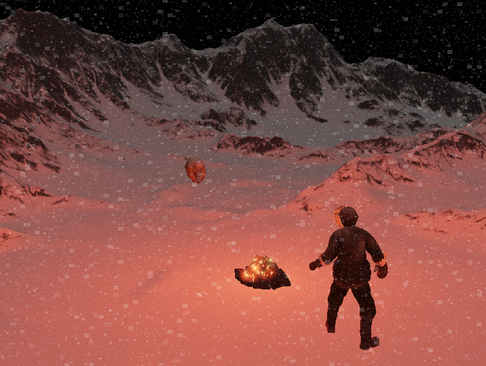

# Alpine encounter

mi22087 - Pavle Sekešan

Displays a snowy mountain scene with an explorer near a fireplace encountering a polar bear.

A spot light is used for the fireplace lighting and a directional light for ambient lighting, with an additional bloom
effect for the burning firewood.

A postprocessing snow effect with multiple snowflake layers of differing movement and sizes is displayed over the whole
screen.

## Controls

- Enter -> Increase fireplace light intensity
- Right Shift -> Decrease fireplace light intensity
- Number 1 -> Fireplace toggle
- Left Arrow -> Move fireplace light left
- Right Arrow -> Move fireplace light right
- Up Arrow -> Move fireplace light forwards
- Down Arrow -> Move fireplace light backwards
- W -> Move camera forwards
- S -> Move camera backwards
- A -> Move camera left
- D -> Move camera right

## Features

### Fundamental:

- [x] Model with lighting
- [x] Two types of lighting with customizable colors and movement through GUI or ACTIONS
- [x] Number 1 pressed (Fireplace toggle action)--- AFTER_M_SECONDS---Triggers---> Fireplace light turns off --->
  AFTER_N_SECONDS---Triggers---> Fireplace light turns back on

### Group A:

- [x] Frame-buffers with post-processing
- [ ] Instancing
- [ ] Off-screen Anti-Aliasing
- [ ] Parallax Mapping

### Group B:

- [x] Bloom with the use of HDR
- [ ] Deferred Shading
- [ ] Point Shadows
- [ ] SSAO

### Engine improvement:

- [x] Emissive map support
- [x] sRGB texture loading
